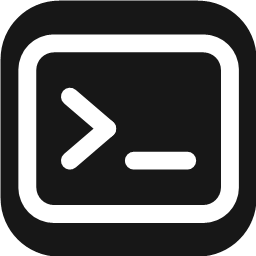

<div align="center">



# Claude Terminal


<p>
  
  
  
  
  
  
</p>

</div>

> **非官方项目**：本项目与 Anthropic 无关联。"Claude" 与 "Claude Code" 是 Anthropic 的商标，本项目仅是配合 Claude Code CLI 使用的第三方终端工具。

## 介绍

**为 [Claude Code](https://claude.com/claude-code) 重度用户准备的多会话管理终端，如果你也有这些痛点，不妨来试试 ：**


- vibe coding 得正 high 呢，不小心把终端关闭了，然后一个一个的自己把刚才的会话/resume回来

- 同时开了七八个会话，不知道哪个会话做完了，哪个会话正在跑，哪个会话需要决策

- 后台跑着cc，切换到其他界面，必须要切换到终端挨个查看才能知道现在做到什么情况了

- 想直观的看到这个目录下有多少会话，想方便的切换会话

- 突然想到和某个会话有关的点子，需要记录下来，用记事本又太繁琐


## 功能

- **标签绑定** — 标签页和 Claude Code 会话绑定，关闭后重新打开会自动接上原来的对话，聊到一半的内容都还在
- **会话状态** — 每个会话的标签上都带有状态点：正在干活、等你输入、已完成、出错了，会话当前的状态一目了然
- **按项目分组** — 标签按工作目录分成组，一组标签可以保存下来反复使用；多套工作区互相隔离
- **多窗口** — 多屏需求也能满足，支持把标签拖出来变成独立窗口
- **历史记录** — 今天、昨天、更早的会话都会自动保存，误关了也能找回来
- **桌面悬浮窗** — 浮窗常驻桌面角落，所有会话的状态尽收眼底，不用切回主窗口
- **额度展示** — 面板实时显示账号额度和上下文占用，不用安装任何插件
- **cc版本控制** — 不想被 cc 自动升级打断工作？锁定版本、关掉自动更新
- **不修改你的配置** — 基于 PowerShell 7 和 Windows 原生伪终端（ConPTY），不修改你的全局 shell 和 cc 配置
- **会话标签** - 在标签上添加备注，提醒自己别忘了
- **界面** — 中英文双语支持，浅色/深色主题支持

## 快速开始

需要准备：

- Windows 10 1809 或更新版本，并安装 [PowerShell 7](https://github.com/PowerShell/PowerShell)
- 已安装 [Claude Code CLI](https://claude.com/claude-code)

macOS 也能构建使用，但安装包没有签名，首次打开需要右键 → 打开。

## 开发与构建

```bash
npm install        # .npmrc 已配好 electron 镜像与 legacy-peer-deps
npm run dev        # 开发模式
npm run dist       # 打包：NSIS 安装包 + 便携 zip（Windows）
npm run dist:mac   # macOS 打包（只能在 macOS 上执行）
```

## 参与进来

欢迎 Star，欢迎提 Issue 和 PR！无论是发现了 bug、有新功能的想法，还是觉得哪里用着别扭，都可以来聊聊。

## 许可证

[GPL-3.0](LICENSE) — 可以自由使用和二次开发；分发修改版需要以同样的许可证开源。
